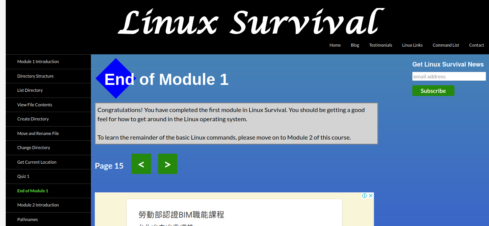

# kottans-frontend
Kottans frontend course (2022)

--------------------------------------

Git, GitHub, git flow
--------------------------------------

`2022-09-07 18:10`
Щойно закінчив знайомство з __Git__. Потужний інструмент. Must-have для кожного IT-вця.

Що ще прочитати про Git:

- [x] [Лекція по Git](https://www.youtube.com/playlist?list=PLS8sEUxbfFY9MnPIFPTNlaS5xX7P5Ge-5) від Олексія Руденка
`2022-09-10 17:40`

_Нове:_
   - крива навчання;
   - підхід до світогліду у форматі `Обізнаність -> Знання -> Навички -> Майстерність`: навіть проста обізнаність про певні явища/тенхології/події підвищує вашу здатність у вирішенні проблеми;

_Здивувало:_
  - підхід 'Обізнаність -> Знання -> Навички -> Майстерність';

_Використаю в майбутньому:_
  -  не буду обмежувати свою обізнаність;

- [x] [Git за 30 хвилин](https://codeguida.com/post/453)
`2022-09-11 17:44`

_Нове:_
   - робота з віддаленими репозиторіями `git remote add; git push origin [branch]`;

_Використаю в майбутньому:_
  - можливості _.gitignore_;

- [x] [Git tips](http://sixrevisions.com/web-development/git-tips/) — закріпити свої знання про Git
`2022-09-07 19:18`

_Нове:_
   - не бійтесь помилятсь, майже все в Git можна відновити;

_Здивувало:_
   - не бійтесь помилятсь, майже все в Git можна відновити;

_Використаю в майбутньому:_
  - можливість атомарних змін (одна правка - один commit);

- [x] [About Merge Conflicts](https://docs.github.com/en/free-pro-team@latest/github/collaborating-with-issues-and-pull-requests/about-merge-conflicts)
- [x] [Resoilving a Merge Conflict](https://docs.github.com/en/free-pro-team@latest/github/collaborating-with-issues-and-pull-requests/resolving-a-merge-conflict-using-the-command-line)

`2022-09-11 18:17` (один відгук на 2 статті про merge conflicts)

_Нове:_
   - merge-конфлікти можуть виникати у випадку видалення файлу;

_Використаю в майбутньому:_
  - вбудований в github редактор конфліктів;

- [x] [Communicating using Markdown](https://lab.github.com/githubtraining/communicating-using-markdown)
`2022-09-10 20:33`

_Нове:_
   - вивчив інструмент розмітки Markdown;

_Здивувало:_
   - простота у використанні розмітки;
   - онлайн превьюер на hithub;

_Використаю в майбутньому:_
   - Дуже зручно користуватись при оформленні сторінок типу README та іншої документації;

- [x] [Learn anything front-end](https://learn-anything.xyz/web-development/front-end)

`2022-09-11 18:36`
_Нове:_
   - кількість інструментів, які використовуються для роботи з фронтендом;

_Здивувало:_
   - це якась "кроляча нора", понад 20 технологій/фреймворків;
   - а якщо перейти по посиланням, то ще по 20 (як у тій історії про винайдення шахів `;-((` );

_Використаю в майбутньому:_
   - краще використати це посилання як довідник - шукати там інформацію при виникненні питань (або ж для розширення обізнаності);

- [x] [TypingClub](https://www.typingclub.com/) — покращити швидкість набору на клавіатурі

`2022-09-08 20:58`
Typingclub - гарний клавіатурний тренажер. Є можливість тренуватись в наборі латиницею. Займаюсь ще з 2019 року.

- [x] [How to Learn and Cope with Negative Thoughts](https://guides.hexlet.io/learning/) 
`2022-09-10 22:14`

_Нове:_
   - програмування (витривалість+концетрація) - це навичка, яку треба можна розвивати;
   - "відкритість" допомагає досягти прогресу;

_Здивувало:_
   - свідомість може творити спротив(навіть з реальними фізичними симптомами);

_Використаю в майбутньому:_
   - відстежуй прогресс(а якщо його довго немає - змінюй підход);

## Linux CLI, and HTTP

  
  
  
  

- [x] Linux Survival

_Нове:_
   - робота з принтером;

_Здивувало:_
   - я вже знайомий з командним рядком linux, тому здивований не був;

_Використаю в майбутньому:_
   - pipe `|`;
   - grep;

- [x] HTTP: Протокол, який повинен розуміти кожний веб-розробник

_Нове:_
   - ознайомився з особливостями протоколу HTTP, сформував загальне уявлення;

__Додаткові матеріали__
- [x] [How I taught myself to code in eight weeks](http://lifehacker.com/how-i-taught-myself-to-code-in-eight-weeks-511615189)

_Здивувало:_
   - за 2 місяці (8 тижнів) автор написав свій перший проект;

_Використаю в майбутньому:_
   - спробую повторити шлях автора;

- [ ] [How JavaScript works: Deep dive into WebSockets and HTTP/2 with SSE + how to pick the right path](How JavaScript works: Deep dive into WebSockets and HTTP/2 with SSE + how to pick the right path)

__Опціонально__
- [ ] [Command Line Power User](https://commandlinepoweruser.com/)
- [ ] [Configuring Linux Web Servers](https://www.udacity.com/course/configuring-linux-web-servers--ud299)
- [ ] [Networking for Web Developers](https://www.udacity.com/course/networking-for-web-developers--ud256)

## Git Collaboration

  
  
  
  

- [x] Introduction to Git and GitHub(тижні 3 і 4)

_Нове:_
   - review кода;
   - Continious integration & continiuos delivery;

_Здивувало:_
   - Continious integration & continiuos delivery;

_Використаю в майбутньому:_
   - CI/CD;

- [x] learngitbranching.js.org віддалені репозиторії

_Нове:_
   - робота з віддаленими репозиторіями, гілками;
   - опція `cherry-pick`;

_Здивувало:_
   - використання `git push origin` та `git fetch origin` без джерела;

_Використаю в майбутньому:_
   - буду використовувати роботу з віддаленими репозиторіями/гілками, оскільки це потужний інструмент в командній розробці;
   - `git cherry-pick`;
   - `git rebase`;